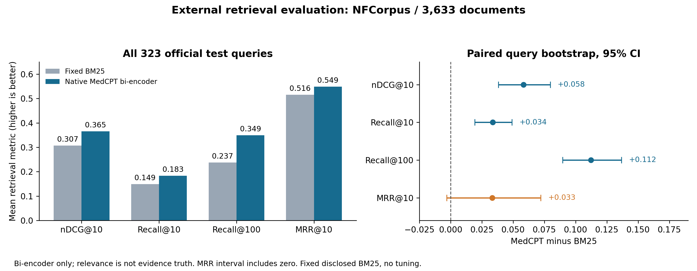
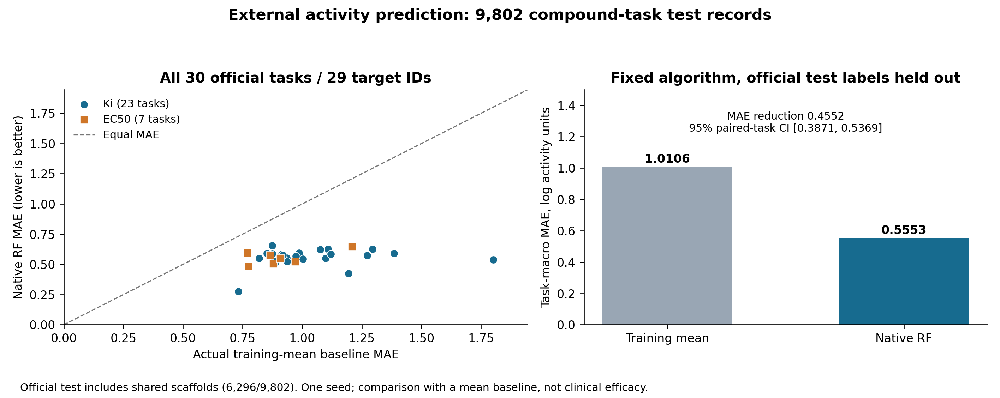

# 채택한 검색·활성 예측 부품의 외부 평가

EVIDA의 기존 제품 코드를 고정한 뒤, 별도의 공개 데이터로 검색과 활성 예측 부품을 평가했다. 기존 SciFact188 및 LPAR1/PDE4B 입력 수리 비교에 더해진 새 평가이며, 앞선 실험을 재실행하거나 분모에 합산하지 않았다. 새 외부 LLM·모델 API 호출은 0회다.

| 채택한 부품 | 새 평가 자료 | 실제 결과 | 제품에서의 역할 |
|---|---|---|---|
| MedCPT bi-encoder | NFCorpus 공식 test 323질문·3,633문헌 | nDCG@10 0.3072→0.3655, Recall@100 0.2372→0.3494 | 확보한 문헌을 의미적 관련성으로 탐색 |
| 조건부 RF 활성 예측 | MoleculeACE 30공식 과제·29표적 ID·9,802시험 기록 | 과제 평균 MAE 1.0106→0.5553, Spearman0.7582 | 내부 골격 검증을 통과한 모델의 조건부 예측 |

화살표의 비교군은 각각 고정 BM25와 실제 학습 부분의 평균값이다. 최신 외부 모델이나 전체 연구 에이전트 대비 결과를 뜻하지 않는다. 과학적 근거 강도·임상 효능·생성 분자의 실측 활성은 이 두 평가의 정답이 아니다.

## 문헌 검색



- 전체 323질문을 포함했고 거부·실패는 0이었다. 원 순위를 먼저 고정한 뒤 공식 관련성 표로 평가했다.
- nDCG@10 차이는 +0.0583, 질문 단위 bootstrap95% 구간 [0.0381,0.0797]이었다. Recall@100 차이는 +0.1122 [0.0896,0.1367]이었다.
- MRR@10 차이는 +0.0332 [−0.0032,0.0721]로 0을 포함했다. 네 지표와 질문별 결과를 모두 공개한다.
- 공개된 MedCPT bi-encoder와 제품의 토큰화·표현·내적 규칙을 유지했다. 사본의 장치 배치를 GPU로 옮긴 오프라인 평가이며, 제품 CPU 검색 지연으로 해석하지 않는다.
- 관련성 정답은 원 웹사이트의 문헌 연결을 기반으로 한다. 문헌 주장의 진위 또는 EVIDA 최종 답변 정확도는 별도 평가 대상이다. 저자 학습 자료와의 문헌 중복 가능성을 배제하지 않았다.

## 활성 예측



- 공식 train38,912행에서 제품의 내부 Murcko 분할을 그대로 적용해29,198행으로 학습하고9,714행으로 사용 기준을 확인했다. 별도 official test9,802행을 모두 평가했다.
- RF300트리·최소 잎2·Morgan반경2/2,048비트/입체성을 고정했다. 30/30과제가 내부 사용 기준을 통과했고, 30/30과제에서 외부 MAE가 학습 평균값보다 낮았다.
- 과제 평균 MAE 감소는0.4552 [95% paired task CI0.3871–0.5369], 평균값 기준선 대비45.05%였다. 이 비율의 비교 대상을 생략하지 않는다.
- Ki23과제와EC50 7과제를 각각 학습했다. nM 원값에서 `p=9−log10(nM)`를 대조했고, native 학습값의 소수 셋째 자리 처리와 반올림하지 않은 외부 정답을 구분했다.
- 각 과제의 공식 train/test 사이 동일 isomeric구조·connectivity 중복은0이었다. 다만6,296/9,802개 시험 기록은 공식 train의 골격을 공유했다. 전체 시험을 새 골격 검증으로 표현하지 않는다.
- activity-cliff 표시3,790행을 포함했으며 과제 평균 cliff RMSE는0.8222였다. 원 assay·종·조건을 모두 보존한 신규 생물실험은 아니다.

## 공개 파일과 재계산

- `methods-summary-stage1.json`: 평가 조건·분모·모든 집계·해시·한계.
- `nfcorpus-per-query-metrics.csv`: 질문 ID별 양쪽 성적. 질문 본문은 포함하지 않는다.
- `moleculeace-per-task-metrics.csv`: 30개 과제 전체 결과. 원 자료의 분자 구조·활성값은 아래의 고정 판본에서 확인한다.
- `reproduce_metrics.py`: 두 CSV에서 평균·차이·사전 고정 bootstrap을 재계산한다. NumPy가 설치된 환경에서 `python reproduce_metrics.py`로 실행한다. 원 예측을 다시 만들거나 모델을 학습하지 않는다.
- PNG·SVG·PDF 그래프는 같은 집계로 작성했다. 신뢰구간은 각각 질문·과제를 재표본하며 독립성의 한계를 유지한다.

조건부 생성기 CReM은 별도 시간 예산 평가가 진행 중이며 이 문서의 완료 성과에 포함하지 않았다. 원 210초 조건과 더 긴 조건의 결과를 서로 합산하지 않는다.

## 1차 자료

- [NFCorpus 저자 자료](https://webserver.cl.uni-heidelberg.de/statnlpgroup/nfcorpus/), [BEIR 공식 배포 목록](https://github.com/beir-cellar/beir/wiki/Datasets-available).
- [MedCPT, Jin 등, Bioinformatics2023](https://pmc.ncbi.nlm.nih.gov/articles/PMC10627406/).
- [MoleculeACE 저자 저장소](https://github.com/molML/MoleculeACE), [van Tilborg 등, JCIM2022](https://doi.org/10.1021/acs.jcim.2c01073). 원 공식 CSV의 commit은 `7e6de0bd2968c56589c580f2a397f01c531ede26`이다.
- [TREC nDCG 구현](https://github.com/usnistgov/trec_eval/blob/master/m_ndcg_cut.c).

## 저장된 순위·예측에서 원 지표 검산

- `nfcorpus-rankings-top100.json.gz`: 두 방법이 실제 반환한 상위 100개 문헌 ID. 4개 지표에 필요한 원 순위를 보존했다.
- `moleculeace-test-predictions.csv.gz`: 공식 평가 9,802개 화합물–과제 기록의 예측·기준 예측·원 CSV 행 위치. 구조와 정답은 공식 원 자료에서 대조한다.
- `verify_saved_predictions.py`: 공식 정답 파일의 SHA256을 확인하고, 저장 순위·예측에서 질문별·과제별 원 지표를 재계산한다. 새 학습·추론·다운로드를 실행하지 않는다.
- `prediction-sources.json`과 `public-protocol-stage1.json`: 원 자료의 URL·해시·판본·분모를 제공한다.

먼저 `public-protocol-stage1.json`의 `nfcorpus_download`에 있는 공식 ZIP을 받아 해시를 확인하고 압축을 푼다. MoleculeACE 자료는 `moleculeace.download_files`의 고정 commit URL에서 받아 한 폴더에 둔다. 원 자료의 라이선스·이용 조건은 해당 출처를 따른다. NumPy와 SciPy 환경에서 아래와 같이 원 지표를 검산할 수 있다.

```bash
python verify_saved_predictions.py --nfcorpus-qrels /path/to/nfcorpus/qrels/test.tsv --moleculeace-data /path/to/moleculeace
python reproduce_metrics.py
```

독립 재검산에서 검색 지표 2,584개 값은 완전히 일치했고, 활성 예측 지표의 최대 수치 차이는 2.23×10⁻¹⁶ 미만이었다. `verification.json`에 검수 범위를 기록했다.
