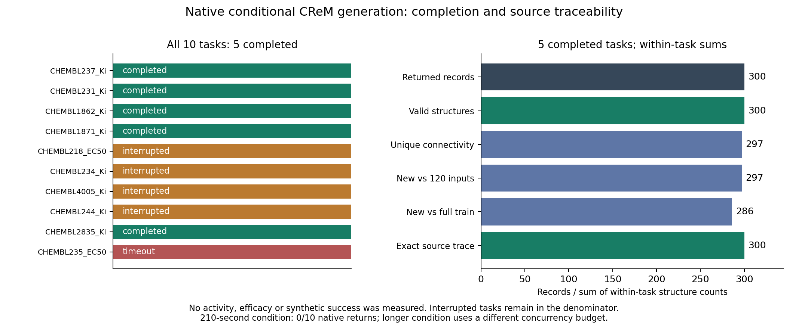

# 출처 기반 CReM 구조 생성 평가

제품의 기존 CReM 생성·물성 필터·선택 코드를 고정해 공개 MoleculeACE의10개 과제를 평가했다. 과제당120개 공식 학습 구조를 입력하고 최대60개 제안을 반환하도록 했다. 활성 레이블·RF 예측·도킹을 사용하지 않았다.

| 시간·자원 조건 | 전체 과제 | 최종 반환 완료 | 실행 상태 |
|---|---:|---:|---|
|210초, 동시1과제·과제당CPU2|10|0|10개 시간 한도 도달|
|900초, 초기 동시4·후속 동시2·과제당CPU2|10|5|{"completed": 5, "coordinator_interruption": 4, "timeout": 1}|

초기900초 실행기의 중단으로4개 과제의 중간 산출물을 보존했다. 원인과 신호 발신자는 확정하지 않았다. 완료4개와 중단4개를 재실행하지 않고, 미시작2개만 동일 입력·원 worker·900초 조건으로 시작했다. 자원 동시성도 달라져 순수 시간 한도 효과로 해석하지 않는다. 두 시간 조건의 생성 수를 합산하지 않는다.

완료한5개 과제의 반환 기록은 합계300개다. 과제별 입체성 포함 고유 구조 수의 합은299, 연결 구조 기준 합은297이다. 입력120구조 대비 새로운 연결 구조는297, 각 과제의 전체 공식 학습 구조 대비 새로운 연결 구조는286이다. 이 합은 과제 간 중복을 제거한 분자 수나 문헌 전체의 신규성을 의미하지 않는다.

반환 구조300/300개가 RDKit 파싱을 통과하고, 300/300개가 원출발물질·변환·반경·출력의 정확한 공개 yield 기록과 연결된다. 유효성은 필터를 통과해 반환된 구조의 성질이며, 관측하지 않은 모든 내부 생성 시도의 성공률은 아니다. 실제 원부모와 동일한 반환은0개다. 합성 가능성·활성·효능은 추가 실험으로 확인해야 한다.

`crem-per-task-metrics.csv`는 두 조건의20행 전체와 원trace·결과 해시를 담고, `crem-summary.json`은 완료 과제 단위의 기술적 bootstrap구간과 중단 분모를 함께 보존한다. 완료 과제만의 구간을 전체 과제 성공 성능으로 확대하지 않는다. `reproduce_crem_metrics.py`로 저장 CSV의 집계와 구간을 재계산할 수 있다. 새 생성이나 학습은 실행하지 않는다.

1차 자료: [CReM 원전](https://doi.org/10.1186/s13321-020-00431-w), [MOSES의 구조 지표](https://pmc.ncbi.nlm.nih.gov/articles/PMC7775580/), [MoleculeACE 저자 자료](https://github.com/molML/MoleculeACE). 이번 평가는 기존 설치 부품의 조건부 생성 감사이며 MOSES 전체 벤치마크 재현 또는 저자 대비 성능 경쟁이 아니다.

실행 이력에는 최초 테스트 실행기의 라이브러리 import 오류10건도 보존했다. 이10건은 분자 생성 전에 실패했으며, 제품과 같은 라이브러리 로드 순서를 적용한 뒤 동일한 입력과 생성 알고리즘으로210초 조건을 실행했다.
